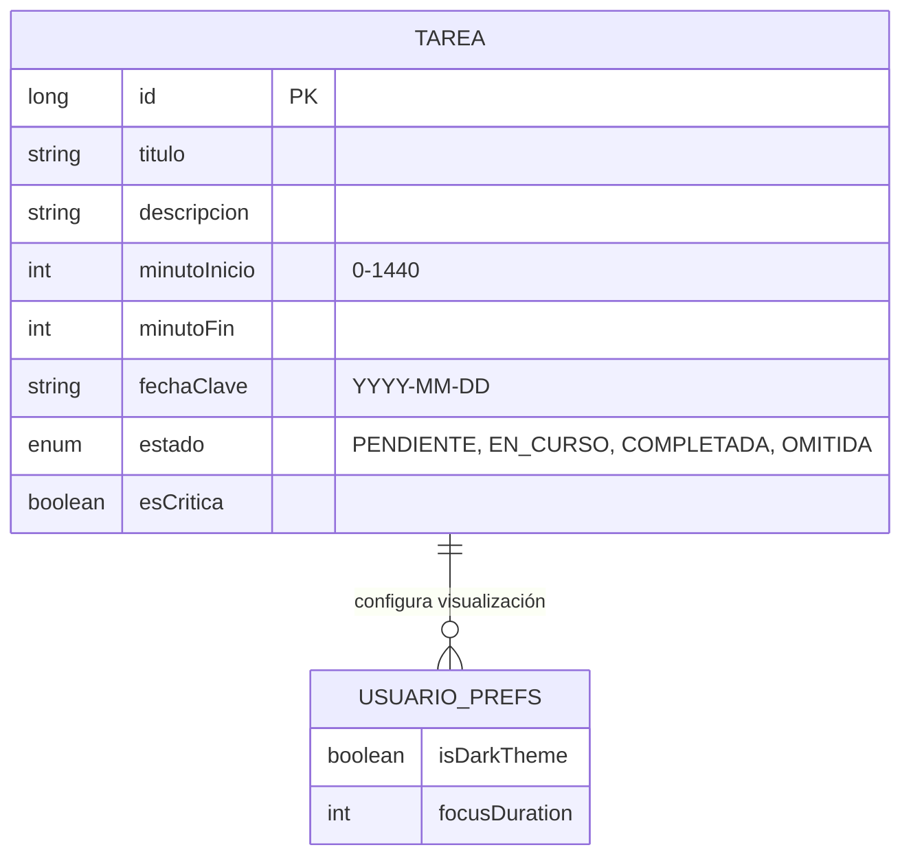

# PORTAFOLIO DE INGENIERÍA DE SOFTWARE - KAIROS RHYTHMOS
**Autor:** Leonardo Ahumada (+ Antigravity Co-Pilot)
**Versión:** 1.0 (MVP Espartano)

---

## 1. ARQUITECTURA Y DISEÑO DE SOFTWARE

### 1.1 Filosofía de Diseño: Clean Architecture con KMP
El núcleo de Kairos Rhythmos se basa en una arquitectura de **Separación de Responsabilidades Estricta**. A diferencia de las aplicaciones móviles tradicionales acopladas al framework (Android/iOS), este sistema implementa una división basada en Dominios Puros:
*   **Independencia de UI:** La lógica de negocio (Entidad `Tarea`, reglas de tiempo) vive en el módulo `commonMain` y no sabe si está siendo dibujada en una pantalla táctil, un monitor o un reloj.
*   **Core Compartido ("The Spartan Monolith"):** El 95% del código es agnóstico a la plataforma. Solo se escribe código nativo cuando es estrictamente necesario para acceder al hardware (Vibración, Alarmas).

### Diagrama de Arquitectura (Código Fuente Mermaid)
Copia este código en [Mermaid Live Editor](https://mermaid.live/) para generar el gráfico:

```mermaid
graph TD
    subgraph KMP_COMMON [Common Main (Kotlin Puro)]
        UI[Presentation Layer - Compose UI]
        VM[ViewModel - State Management]
        DOM[Domain Layer - Use Cases]
        REP[Repository Interface]
    end

    subgraph DATA_LAYER [Data Layer]
        SQL[Room Database (KMP)]
        PREFS[ThemeStorage (Expect/Actual)]
    end

    subgraph PLATFORM_ANDROID [Android Native]
        ACT[AlarmaActivity]
        VIB[Vibrator Service]
    end

    subgraph PLATFORM_IOS [iOS Native]
        VC[MainViewController]
        NOTIF[UserNotifications]
    end

    UI --> VM
    VM --> DOM
    DOM --> REP
    REP --> SQL
    REP --> PREFS
    ACT --> UI
    VC --> UI
    style KMP_COMMON fill:#e1f5fe,stroke:#01579b
    style PLATFORM_ANDROID fill:#e8f5e9,stroke:#2e7d32
    style PLATFORM_IOS fill:#f3e5f5,stroke:#7b1fa2
```

### 1.2 Modelo de Objetos
El sistema modela el tiempo no como fechas, sino como **Flujos de Minutos**. La entidad central `Tarea` encapsula no solo datos, sino comportamiento de estado (`PENDIENTE`, `EN_CURSO`, `COMPLETADA`).

### 1.3 Stack Tecnológico y Decisiones de Ingeniería

| Capa / Componente | Tecnología | Justificación Técnica |
| :--- | :--- | :--- |
| **Presentación** | Jetpack Compose Multiplatform | Permite una **UI Declarativa Unificada**. Se escribe una vez en Kotlin y se renderiza nativamente en Android (Canvas) e iOS (Skia), garantizando consistencia pixel-perfect. |
| **Negocio (Core)** | Kotlin 2.0 (Coroutines) | Lógica asíncrona no bloqueante. Uso de `Flow` y `StateFlow` para reactividad en tiempo real (MVI). |
| **Persistencia Liger** | Expect/Actual (Nativo) | Implementación propia de `ThemeStorage` que mapea a **SharedPreferences** (Android) y **NSUserDefaults** (iOS) para máxima eficiencia sin librerías pesadas. |
| **Base de Datos** | Room KMP (SQLite) | Estandarización de consultas SQL y reactividad. Permite que la UI se actualice automáticamente si el backend de datos cambia. |
| **Hardware** | Vibrator Service / AlarmManager | Acceso de bajo nivel para garantizar la **"Disciplina Espartana"** (interrupciones de alta prioridad). |

---

## 2. PLANTEAMIENTO DEL PROBLEMA Y SOLUCIÓN

### 2.1 Situación Original (AS-IS)
El usuario moderno sufre de una desconexión entre la planificación (Listas de Tareas digitales) y la ejecución física. Las apps actuales son "pasivas": sugieren hacer algo, pero se pueden ignorar fácilmente con un swipe.
### Diagrama de Flujo: El Problema vs La Solución
```mermaid
graph LR
    subgraph AS_IS [Situación Actual (Apps Pasivas)]
        A1[Notificación Suena] --> B1{¿Usuario Ocupado?}
        B1 -- Sí --> C1[Swipe / Ignorar]
        C1 --> D1[Tarea Olvidada]
        B1 -- No --> E1[Hacer Tarea... Quizás]
    end

    subgraph TO_BE [Solución KAIROS (Disciplina)]
        A2[Alarma Kairos Suena] --> B2[Bloqueo de Pantalla Total]
        B2 --> C2[Vibración Infinita]
        C2 --> D2{¿Decisión?}
        D2 -- OMITIR --> E2[Registro de Fallo (Vergüenza)]
        D2 -- COMPLETAR --> F2[Registro de Éxito (Dopamina)]
    end
    style AS_IS fill:#ffebee,stroke:#c62828
    style TO_BE fill:#e8f5e9,stroke:#2e7d32
```

### 2.2 Solución Implementada (TO-BE)
Kairos Rhythmos convierte el tiempo en una magnitud física (Arcos visuales y Vibración háptica).
*   **Visibilidad:** El usuario ve el día como un ciclo finito (Círculo), no una lista infinita.
*   **Coerción:** La alarma "Mini-Kairos" bloquea la pantalla y vibra infinitamente hasta que se toma una decisión consciente (Sí o No).
**[INSERTE CAPTURA: RELOJ KAIROS CON TAREAS Y ÓRBITAS]**

---

## 3. SEGURIDAD Y PERSISTENCIA DE DATOS

### 3.1 Almacenamiento Local Seguro
Aunque no es una app bancaria, los datos del usuario son sagrados.
*   **Aislamiento:** La base de datos SQLite (Room) está sandboxed dentro del directorio privado de la aplicación en cada SO.
*   **Persistencia Atómica:** Las operaciones de escritura (Crear Tarea) son transaccionales. O se guarda todo, o no se guarda nada, evitando estados corruptos.

### Diagrama Entidad-Relación (ERD)


---

## 4. FUNCIONALIDADES CLAVE Y UX (EXPERIENCIA DE USUARIO)

### 4.1 Ingeniería Gráfica: El Reloj Trigonométrico
En lugar de usar imágenes estáticas, el componente `RelojKairos` dibuja el tiempo matemáticamente en tiempo real usando un `Canvas`.
*   **Cálculo Polar:** Convierte minutos (0-1440) en grados (0-360) usando funciones `sin` y `cos`.
*   **Órbitas Dinámicas:** Las tareas completadas "migran" visualmente a una órbita exterior (`radiusEventosOuter`), creando un historial visual del día.
**[INSERTE GIF: ANIMACIÓN DEL RELOJ Y MOVIMIENTO DE TAREAS]**

### 4.2 "Mini-Kairos": Disciplina Espartana (Android)
El sistema utiliza `FullScreenIntent` para saltar sobre cualquier aplicación (YouTube, Juegos) cuando llega la "Hora K".
*   **Vibración Infinita:** Un `Loop` de vibración (`0, 500, 1000`) asegura que el usuario no pueda ignorar la alerta físicamente.
**[INSERTE CAPTURA: PANTALLA DE ALARMA DESBLOQUEANTE]**

---

## 5. LÓGICA DE NEGOCIO AVANZADA: GESTIÓN DE ESTADOS

### Trigger de Lógica de Tiempo
*   **El Problema:** ¿Cómo saber si una tarea "ya pasó" sin gastar batería consultando cada segundo?
*   **La Solución:** El sistema calcula el estado (`PENDIENTE`, `EN_CURSO`, `PASADA`) basándose en la proyección del tiempo actual contra los intervalos almacenados, actualizando la UI solo cuando el minuto cambia.

**Snippet de Lógica de Dibujo (Simplificado):**
```kotlin
val anguloInicio = (tarea.minutoInicio * gradosPorMinuto) - 90
val esPasada = finTarea <= minutoActual
val radio = if (esPasada) radioExterior else radioInterior
// Dibuja el arco en la posición calculada...
```

---

## 6. INFRAESTRUCTURA Y AUTOMATIZACIÓN (V2.0)

### 6.1 Automatización Futura (Strategos AI)
El roadmap técnico incluye la implementación de un **Agente IA Local** que analizará los "huecos" en el anillo del reloj para sugerir bloques de productividad óptimos, basándose en la base de datos histórica de cumplimiento del usuario.

---

## 7. TRAZABILIDAD Y AUDITORÍA

### 7.1 Modelo de Verdad Única
El sistema no permite "borrar" el pasado fácilmente.
*   **Estados Finales:** Una tarea solo puede terminar en `COMPLETADA` (Éxito) o `OMITIDA` (Fallo).
*   **Sin Reprogramación en Crisis:** Al momento de la alarma, la opción de "Reprogramar" se deshabilita intencionalmente para forzar una auditoría honesta del rendimiento del usuario.
*   **Logs Visuales:** El usuario puede ver en el reloj ("Cara Trasera") cuántos minutos reales dedicó a una tarea versus lo planeado.

**[INSERTE CAPTURA: PANTALLA DE REPORTE/MODO FOCUS]**

---
*Este documento es parte del portafolio técnico y representa el estado del arte en desarrollo móvil multiplataforma.*
